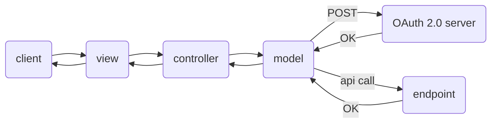

# Rest api testing GUI application written in Python tkinter framework


## Architecture



## Execution

```bash
gh repo clone sauravdwivedi/Apps
cd Apps && cd Python && cd api-testing-gui-app
python3 -m venv venv
source venv/bin/activate
brew install python-tk
pip3 install -r requirements.txt
source env.list
python3 app.py
```

## Alias

```bash
alias apitest='source <path-to-directory>/env.list && python3 <path-to-directory>/app.py'
```